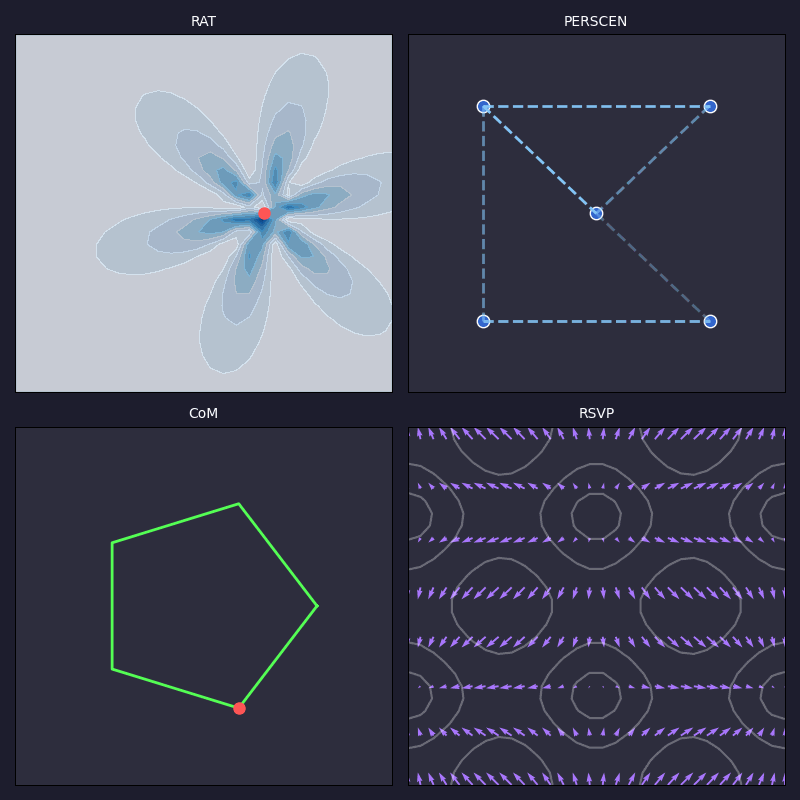

# HYDRA
Hybrid Dynamic Reasoning Architecture

- **Top-Left: Relevance Activation (RAT)**  
  Watch the glowing green-yellow field shift as a red dot moves in a circular path. This represents how HYDRA focuses on what matters most, like a spotlight following a cue—such as a user’s click or a robot’s sensor input—guiding the system’s attention dynamically.

- **Top-Right: Personalized Feature Graph (PERSCEN)**  
  See the blue dots connected by shifting black lines? That’s HYDRA modeling a user’s unique preferences, like favorite products or habits. The lines grow stronger or fade to show how connections evolve, tailoring recommendations for each person.

- **Bottom-Left: Chain of Memory (CoM)**  
  The green spiral path with a red marker traces how HYDRA remembers and refines its understanding over time. It’s like a mental journey through past experiences, ensuring decisions are grounded in a clear, traceable memory trail.

- **Bottom-Right: Semantic Vector Field (RSVP/TARTAN)**  
  Purple arrows and black contours swirl together, showing how HYDRA organizes complex ideas in a structured flow. This is the system’s way of making sense of information, balancing meaning and efficiency, much like how our brains navigate thoughts.
